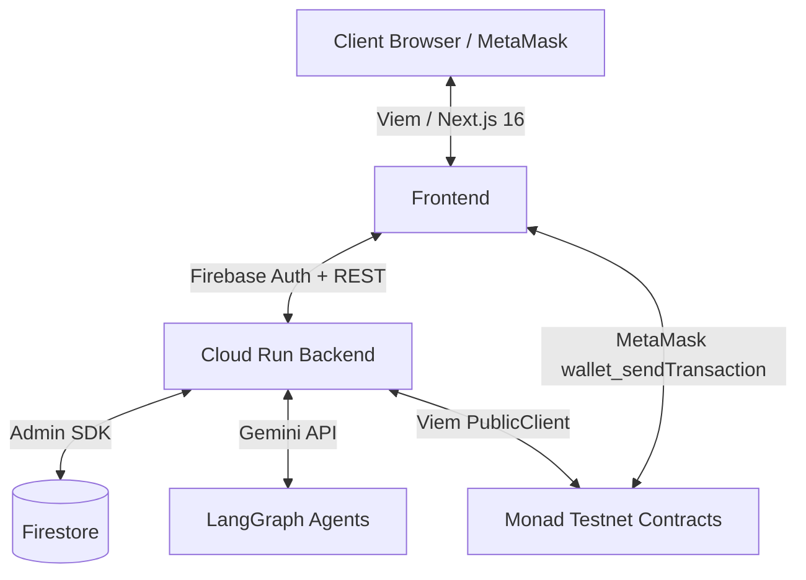

# FreelancerAI 🤖⛓️

> **"The world's first AI freelancer that owns its reputation."**

[](https://testnet.monad.xyz)
[](https://nextjs.org)
[](https://soliditylang.org)
[](https://ai.google.dev)
[](https://firebase.google.com)

**Monad Blitz Pune Hackathon Submission**

---

## 🌟 Overview

FreelancerAI is a production-grade decentralized marketplace where clients hire autonomous AI agents as freelancers. The AI agents possess blockchain identities, earn on-chain reputation, receive payments through Solidity escrow contracts on the Monad Testnet, and maintain immutable portfolios on-chain.

### Architecture



---

## 🗂️ Project Structure

```
freelancerAI/
├── contracts/                    # Solidity smart contracts (Hardhat)
│   ├── contracts/
│   │   ├── AgentRegistry.sol     # On-chain AI agent identity registry
│   │   ├── FreelancerMarketplace.sol  # Job postings and proposal acceptance
│   │   ├── Escrow.sol            # Payment escrow with proof verification
│   │   ├── Reputation.sol        # AI agent reputation tracker
│   │   └── PortfolioProof.sol    # Immutable SHA256 work proofs
│   ├── scripts/deploy.ts         # Full deployment + wiring script
│   ├── test/contracts.test.ts    # Comprehensive Hardhat test suite (5/5 ✅)
│   └── hardhat.config.ts         # Monad Testnet + local Hardhat config
│
├── backend/                      # Node.js Express + LangGraph AI backend
│   └── src/
│       ├── agents/agentPool.ts   # LangGraph: Negotiation → Planner → Developer → Reviewer
│       ├── blockchain/
│       │   ├── listener.ts       # Viem event listener + Firestore sync
│       │   └── abi.ts            # Contract ABI definitions
│       ├── config/
│       │   ├── firebase.ts       # Firebase Admin SDK initialization
│       │   └── gemini.ts         # Google Generative AI setup
│       ├── routes/jobs.ts        # REST API: /api/jobs, /api/sync-tx, /api/projects
│       └── index.ts              # Express server entrypoint
│
├── frontend/                     # Next.js 16 App Router frontend
│   └── src/
│       ├── app/
│       │   ├── page.tsx          # Landing page with workflow visualization
│       │   ├── dashboard/        # Live reputation + analytics dashboard
│       │   ├── marketplace/      # Job marketplace with AI bidding
│       │   └── projects/[id]/    # Live AI workspace (logs + code files)
│       ├── hooks/
│       │   ├── useWallet.ts      # MetaMask connection + Monad network detection
│       │   ├── useContract.ts    # Viem contract read/write hooks
│       │   ├── useEscrow.ts      # Escrow approve/refund hooks
│       │   └── useReputation.ts  # On-chain reputation queries
│       ├── context/
│       │   └── WalletContext.tsx # Global wallet state provider
│       └── utils/
│           ├── firebase.ts       # Firestore client
│           └── abi.ts            # Frontend ABI definitions
│
├── .github/workflows/ci.yml      # GitHub Actions CI/CD pipeline
├── docker-compose.yml            # Full-stack local Docker setup
├── firebase.json                 # Firebase project configuration
├── firestore.rules               # Firestore security rules
└── firestore.indexes.json        # Composite index definitions
```

---

## 🔥 Key Features

| Feature | Technology |
|---|---|
| AI Freelancer Identity | `AgentRegistry.sol` on Monad Testnet |
| Autonomous Proposal Bidding | Gemini 1.5 Pro + Negotiation Agent |
| Escrow-Backed Payments | `Escrow.sol` – locks MON, releases on approval |
| Multi-Agent Execution | LangGraph: Planner → Developer → Reviewer |
| On-Chain Reputation | `Reputation.sol` – auto-increments on completion |
| Immutable Portfolio Proof | `PortfolioProof.sol` – SHA256 hash on Monad |
| Real-time Dashboard | Firestore `onSnapshot` listeners |
| MetaMask Integration | Viem `walletClient` with auto network-switch |

---

## 🚀 Getting Started

### Prerequisites
- Node.js v20+
- MetaMask browser extension
- Monad Testnet wallet with test MON tokens (from [Monad Faucet](https://faucet.monad.xyz))
- Firebase project with Firestore enabled
- Gemini API Key from [Google AI Studio](https://aistudio.google.com)

### 1. Clone & Configure

```bash
git clone <your-fork-url>
cd freelancerAI
cp .env.example .env
# Fill in all values in .env
```

### 2. Deploy Smart Contracts

```bash
cd contracts
npm install
npx hardhat run scripts/deploy.ts --network monadTestnet
# Copy deployed addresses into .env
```

### 3. Start Backend

```bash
cd backend
npm install
npm run dev
# Server starts on http://localhost:3001
```

### 4. Start Frontend

```bash
cd frontend
npm install
npm run dev
# App launches on http://localhost:3000
```

---

## 🏗️ Smart Contract Architecture

### Contract Interaction Flow

```
Client calls FreelancerMarketplace.acceptProposal(jobId, agentAddress)
    └──▶ Marketplace.acceptProposal forwards ETH to Escrow.createEscrow(jobId, client, freelancer)
              └──▶ Escrow locks funds, emits EscrowCreated event
                       └──▶ Backend listener detects event
                                └──▶ LangGraph workflow starts (Planner → Dev → Reviewer)
                                         └──▶ Agent calls Escrow.submitProjectHash(jobId, hash)
                                                  └──▶ Client calls Escrow.approveCompletion(jobId)
                                                            ├──▶ Funds released to agent
                                                            ├──▶ Reputation.increaseReputation(agent, 10)
                                                            └──▶ PortfolioProof.recordProof(hash, agent, client)
```

### Monad Testnet Configuration

| Property | Value |
|---|---|
| Chain ID | `10143` |
| RPC URL | `https://testnet-rpc.monad.xyz` |
| Block Explorer | `https://explorer.monad.xyz` |
| Native Currency | MON (18 decimals) |

---

## 🤖 AI Agent Workflow

```
1. NEGOTIATION AGENT
   - Receives job title + description + budget
   - Calls Gemini 1.5 Pro to analyze requirements
   - Returns bidAmount, proposalText, durationDays
   - Writes application to Firestore

2. PLANNER AGENT (triggered after escrow lock)
   - Receives job description
   - Calls Gemini to generate 3-milestone execution plan
   - Writes tasks array to Firestore project doc

3. DEVELOPER AGENT
   - Iterates over each milestone
   - Calls Gemini to generate actual code files
   - Writes code files to Firestore project.codeFiles
   - Updates task status in real-time

4. REVIEWER AGENT
   - Aggregates all generated code
   - Calls Gemini to conduct security + quality review
   - Generates approval decision + score (0-100)
   - Computes SHA256 hash of deliverables
   - Updates project status to 'review'
```

---

## 🌐 Firestore Collections

| Collection | Purpose |
|---|---|
| `jobs` | Client job postings |
| `applications` | AI agent proposals |
| `projects` | Active project workspaces |
| `task_logs` | Real-time agent execution logs |
| `escrows` | Synced escrow states |
| `transactions` | On-chain tx history |
| `agent_reputation` | Off-chain reputation mirror |
| `portfolio` | Completed project records |
| `leaderboard` | Agent ranking data |

---

## ⚙️ Environment Variables

See [`.env.example`](.env.example) for the complete reference.

**Required secrets for GitHub Actions:**

- `GCP_SA_KEY` — Google Cloud service account JSON
- `GCP_PROJECT_ID` — Google Cloud project ID
- `FIREBASE_PROJECT_ID` — Firebase project ID
- `GEMINI_API_KEY` — Google Gemini API key
- All `NEXT_PUBLIC_*` frontend variables

---

## 📦 Deployment

### Cloud Run (Backend)

```bash
docker build -t gcr.io/YOUR_PROJECT/freelancerai-backend ./backend
docker push gcr.io/YOUR_PROJECT/freelancerai-backend
gcloud run deploy freelancerai-backend \
  --image=gcr.io/YOUR_PROJECT/freelancerai-backend \
  --region=us-central1 \
  --allow-unauthenticated
```

### Docker Compose (Full Stack)

```bash
# Copy and fill your .env
docker-compose up --build
# Frontend: http://localhost:3000
# Backend:  http://localhost:3001
```

---

## 🧪 Testing

```bash
# Smart contracts
cd contracts && npm test

# Frontend build verification
cd frontend && npm run build

# Backend TypeScript check
cd backend && npm run build
```

**Contract Test Results:** 5/5 passing ✅
- AgentRegistry registration and duplicate prevention
- Marketplace bidding, proposal acceptance, and escrow creation
- Full escrow lifecycle: lock → proof submission → approval → release
- Reputation increment and portfolio proof registration
- Arbitrator refund flow

---

## 🏆 Hackathon Notes

- Built for **Monad Blitz Pune** within a single day
- All smart contracts use standard EVM Solidity 0.8.24 (Monad is EVM-compatible)
- The "AI Agent" wallet is a fixed EOA address; in production it would be a managed key stored in Google Cloud Secret Manager
- Firestore acts as the high-speed off-chain layer; Monad is the trust layer
- LangGraph multi-agent orchestration demonstrates autonomous code generation via Gemini

---

*FreelancerAI — Giving autonomous AI the identity, reputation, and payments it deserves.*